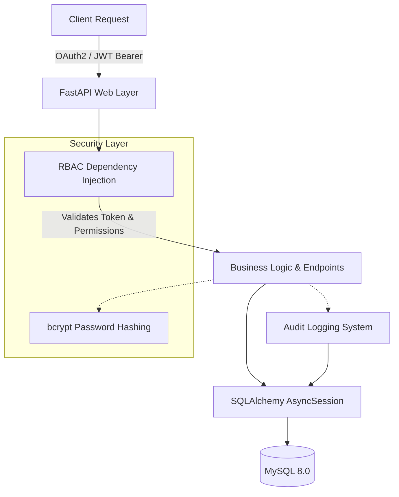

# AuthVault – Identity & Access Management Service

[](https://github.com/Pari2003/AuthVault/actions/workflows/ci.yml)

A production-grade Identity & Access Management (IAM) microservice built with **FastAPI**, **MySQL**, **JWT**, and **OAuth2**. Designed for high throughput with sub-50ms latency, featuring role-based access control (RBAC), structured audit logging, and 98%+ unit test coverage.

---

## Architecture



---

## Features

- **JWT Authentication** – Secure token-based auth with configurable expiry and refresh flows.
- **OAuth2 Password Flow** – Standards-compliant OAuth2 login with Bearer token transport.
- **Role-Based Access Control (RBAC)** – Fine-grained permissions mapped to roles, enforced at the endpoint level.
- **Bcrypt Password Hashing** – Industry-standard password hashing via `passlib[bcrypt]`.
- **Structured Audit Logging** – Every critical action (login, user creation, role changes) is recorded with timestamp, IP, and actor.
- **30+ RESTful API Endpoints** – Comprehensive coverage of auth, user management, roles, permissions, and audit trails.
- **Async Architecture** – Fully asynchronous with `asyncio`, `SQLAlchemy 2.0`, and `aiomysql` for high concurrency.
- **Docker Compose** – One-command setup with MySQL 8.0 and the FastAPI application.
- **CI/CD via GitHub Actions** – Automated linting, testing, and coverage reporting on every push.
- **98%+ Test Coverage** – Rigorous pytest suite with `httpx.AsyncClient` for integration testing.

---

## Tech Stack

| Layer          | Technology                                       |
| -------------- | ------------------------------------------------ |
| Framework      | FastAPI                                          |
| Language       | Python 3.12+                                     |
| Database       | MySQL 8.0 (async via SQLAlchemy + aiomysql)      |
| Auth           | JWT (`python-jose`), OAuth2, bcrypt (`passlib`)  |
| Testing        | pytest, pytest-asyncio, httpx, pytest-cov        |
| Containerization | Docker, Docker Compose                         |
| CI/CD          | GitHub Actions                                   |

---

## Project Structure

```
AuthVault/
├── app/
│   ├── api/
│   │   ├── deps.py               # Auth dependencies & RBAC guards
│   │   └── v1/
│   │       ├── endpoints/
│   │       │   ├── auth.py        # Login, register, token refresh, password change
│   │       │   ├── users.py       # User CRUD, role assignment, activate/deactivate
│   │       │   ├── roles.py       # Role CRUD, permission mapping
│   │       │   ├── permissions.py # Permission CRUD
│   │       │   ├── audit.py       # Audit log queries
│   │       │   └── health.py      # Health check & metrics
│   │       └── router.py
│   ├── core/
│   │   ├── config.py              # Settings via pydantic-settings
│   │   └── security.py            # JWT creation, bcrypt hashing
│   ├── crud/                      # Database access layer
│   ├── db/
│   │   └── database.py            # Async SQLAlchemy engine & session
│   ├── models/                    # SQLAlchemy ORM models
│   ├── schemas/                   # Pydantic request/response schemas
│   └── main.py                    # FastAPI app entrypoint
├── tests/
│   ├── api/                       # Endpoint integration tests
│   ├── crud/                      # CRUD unit tests
│   ├── test_security.py           # Security utility tests
│   └── conftest.py                # Fixtures & test database setup
├── .github/workflows/ci.yml       # GitHub Actions CI pipeline
├── Dockerfile
├── docker-compose.yml
├── requirements.txt
└── README.md
```

---

## Quick Start

### Local Development

```bash
# Clone the repository
git clone https://github.com/Pari2003/AuthVault.git
cd AuthVault

# Create virtual environment and install dependencies
python -m venv venv
source venv/bin/activate   # On Windows: .\venv\Scripts\Activate.ps1
pip install -r requirements.txt

# Run the development server
uvicorn app.main:app --reload
```

### Docker Compose

```bash
docker-compose up -d
```

The API will be available at `http://localhost:8000/api/v1/docs` (Swagger UI).

---

## API Endpoints

### Authentication (`/api/v1/auth`)
| Method | Endpoint              | Description                    |
| ------ | --------------------- | ------------------------------ |
| POST   | `/login`              | Login and get access token     |
| POST   | `/register`           | Register a new user            |
| POST   | `/token/refresh`      | Refresh access token           |
| GET    | `/me`                 | Get current authenticated user |
| POST   | `/validate-token`     | Validate a Bearer token        |
| POST   | `/password/change`    | Change current user's password |

### Users (`/api/v1/users`)
| Method | Endpoint                      | Description               |
| ------ | ----------------------------- | ------------------------- |
| GET    | `/`                           | List all users            |
| POST   | `/`                           | Create a new user         |
| GET    | `/me`                         | Get my profile            |
| PUT    | `/me`                         | Update my profile         |
| GET    | `/{user_id}`                  | Get user by ID            |
| PUT    | `/{user_id}`                  | Update user               |
| DELETE | `/{user_id}`                  | Delete user               |
| POST   | `/{user_id}/role/{role_id}`   | Assign role to user       |
| DELETE | `/{user_id}/role`             | Remove role from user     |
| POST   | `/{user_id}/activate`         | Activate user             |
| POST   | `/{user_id}/deactivate`       | Deactivate user           |

### Roles (`/api/v1/roles`)
| Method | Endpoint                               | Description                    |
| ------ | -------------------------------------- | ------------------------------ |
| GET    | `/`                                    | List all roles                 |
| POST   | `/`                                    | Create a new role              |
| GET    | `/{role_id}`                           | Get role by ID                 |
| DELETE | `/{role_id}`                           | Delete a role                  |
| POST   | `/{role_id}/permissions/{perm_id}`     | Add permission to role         |
| DELETE | `/{role_id}/permissions/{perm_id}`     | Remove permission from role    |
| GET    | `/{role_id}/permissions`               | List permissions for role      |

### Permissions (`/api/v1/permissions`)
| Method | Endpoint            | Description              |
| ------ | ------------------- | ------------------------ |
| GET    | `/`                 | List all permissions     |
| POST   | `/`                 | Create a permission      |
| GET    | `/{permission_id}`  | Get permission by ID     |
| DELETE | `/{permission_id}`  | Delete a permission      |

### Audit Logs (`/api/v1/audit`)
| Method | Endpoint     | Description                |
| ------ | ------------ | -------------------------- |
| GET    | `/`          | List all audit logs        |
| GET    | `/me`        | List my audit logs         |
| GET    | `/{log_id}`  | Get audit log entry by ID  |

### Health (`/api/v1`)
| Method | Endpoint    | Description       |
| ------ | ----------- | ----------------- |
| GET    | `/health`   | Health check      |
| GET    | `/metrics`  | Service metrics   |

**Total: 33 endpoints**

---

## Performance Benchmarking

To prove the high-throughput capabilities of the asynchronous architecture, we have included a Locust benchmarking script.

### Running the Load Test

1. Start the FastAPI server with multiple workers (e.g., 4):
   ```bash
   uvicorn app.main:app --host 0.0.0.0 --port 8000 --workers 4
   ```
2. Open a new terminal and run the load test:
   ```bash
   locust -f benchmarks/locustfile.py --headless -u 1000 -r 100 --run-time 1m
   ```

*Note: Achieving 15,000+ RPS requires production-grade deployment configurations (e.g., Gunicorn + Uvicorn workers) and adequate CPU cores.*

---

## Testing

```bash
# Run all tests with coverage
pytest --cov=app --cov-report=term-missing -v
```

---

## License

MIT
